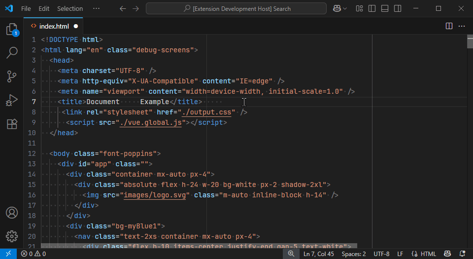

# Selective Indent


Easily convert indentation (tabs <-> spaces) on specific lines or the whole file in VSCode.

---

## Installation

You can install Selective Indent from the [Visual Studio Code Marketplace](https://marketplace.visualstudio.com/) or using the command line:

```bash
code --install-extension your-publisher-id.selective-indent
```

> Replace `your-publisher-id.selective-indent` with the actual identifier once published.

---

## Demo



---

## Commands

| Command                                                           | Description                                   |
| ----------------------------------------------------------------- | --------------------------------------------- |
| `vscode-selective-indent.convertSelectedLinesIndentationToSpaces` | Convert selected lines' indentation to spaces |
| `vscode-selective-indent.convertSelectedLinesIndentationToTabs`   | Convert selected lines' indentation to tabs   |
| `vscode-selective-indent.convertAllLinesIndentationToSpaces`      | Convert all lines' indentation to spaces      |
| `vscode-selective-indent.convertAllLinesIndentationToTabs`        | Convert all lines' indentation to tabs        |

---

## Release Notes

See [`./CHANGELOG.md`](./CHANGELOG.md)

---

## License

Available in [`./LICENSE`](./LICENSE)

---

## Publishing

```bash
npm install -g @vscode/vsce
vsce publish <major|minor|patch>
```
