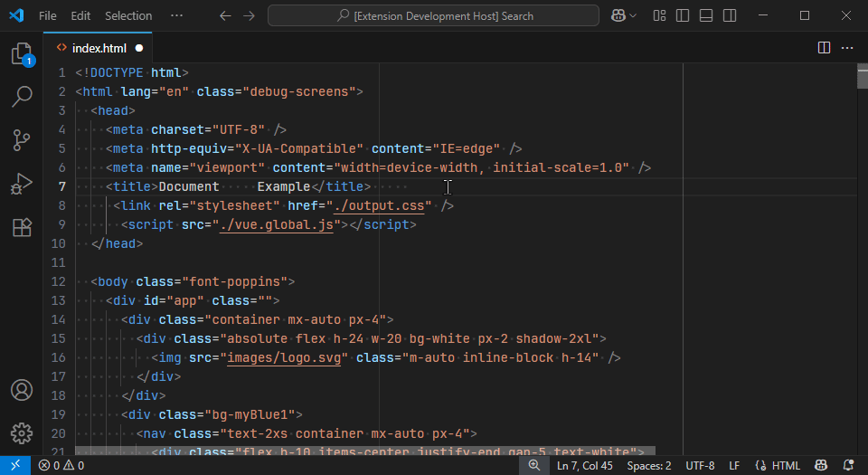
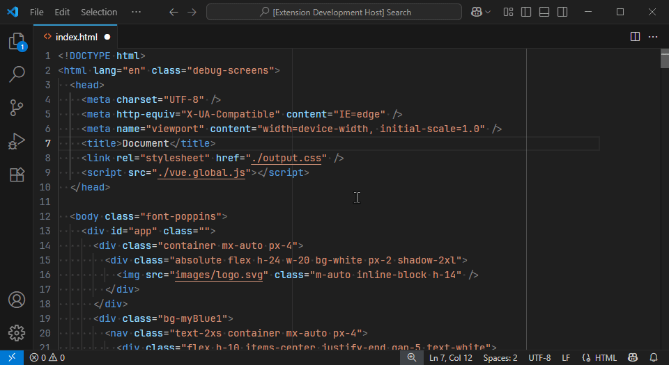

# Selective Indent


Easily convert indentation (tabs <-> spaces) on specific lines or the whole file in VSCode.

---

## Installation

You can install Selective Indent from the [Visual Studio Code Marketplace](https://marketplace.visualstudio.com/items?itemName=isnandar1471.vscode-selective-indent) or using the command line:

```bash
code --install-extension isnandar1471.vscode-selective-indent
```

---

## Demo

- With Command Pallete

  

- With Context Menu

  

---

## Features

- Convert indentation between tabs and spaces
- Supports converting selected lines or entire file
- Accessible from the Command Palette and context menu

---

## Commands

| Command                                                           | Description                                   |
| ----------------------------------------------------------------- | --------------------------------------------- |
| `vscode-selective-indent.convertSelectedLinesIndentationToSpaces` | Convert selected lines indentation to spaces  |
| `vscode-selective-indent.convertSelectedLinesIndentationToTabs`   | Convert selected lines indentation to tabs    |
| `vscode-selective-indent.convertAllLinesIndentationToSpaces`      | Convert all lines indentation to spaces       |
| `vscode-selective-indent.convertAllLinesIndentationToTabs`        | Convert all lines indentation to tabs         |

---

## Release Notes

See [`./CHANGELOG.md`](./CHANGELOG.md)

---

## License

Available in [`./LICENSE`](./LICENSE)

---

## Publishing

```bash
npm install -g @vscode/vsce
vsce publish
```
