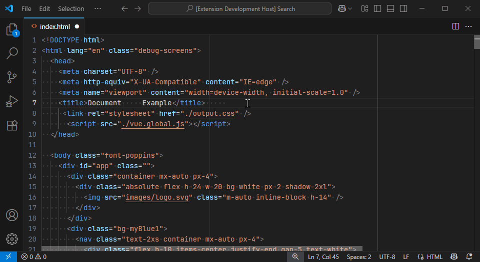
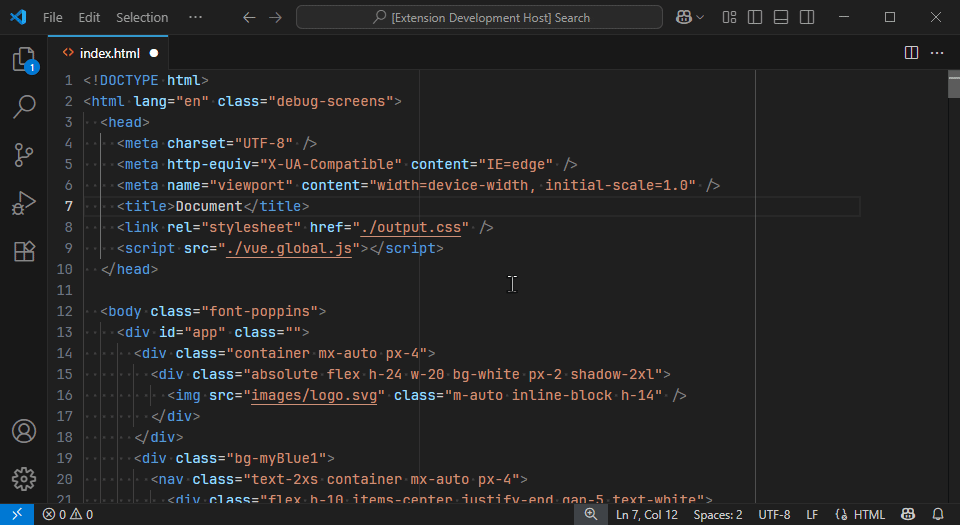

# Selective Indent

Convert indentation between tabs and spaces on selected lines or entire files.

## Installation

You can install this extension directly from your preferred marketplace:

- [**VS Code Marketplace**](https://marketplace.visualstudio.com/items?itemName=isnandar1471.vscode-selective-indent)
- [**Open VSX Registry**](https://open-vsx.org/extension/isnandar1471/vscode-selective-indent)

Alternatively, search for **"Selective Indent"** in your VS Code Extensions tab.

## Usage

Access from Command Palette or right-click context menu:

| Command | Action |
|---------|--------|
| Convert Selected Lines to Spaces | Convert selected lines' indentation to spaces |
| Convert Selected Lines to Tabs | Convert selected lines' indentation to tabs |
| Convert All Lines to Spaces | Convert entire file's indentation to spaces |
| Convert All Lines to Tabs | Convert entire file's indentation to tabs |

## Demo

**Command Palette**

**Context Menu**

## Resources

- [Changelog](./CHANGELOG.md)
- [License](./LICENSE)
- [Development Guide](./docs/development.md)

